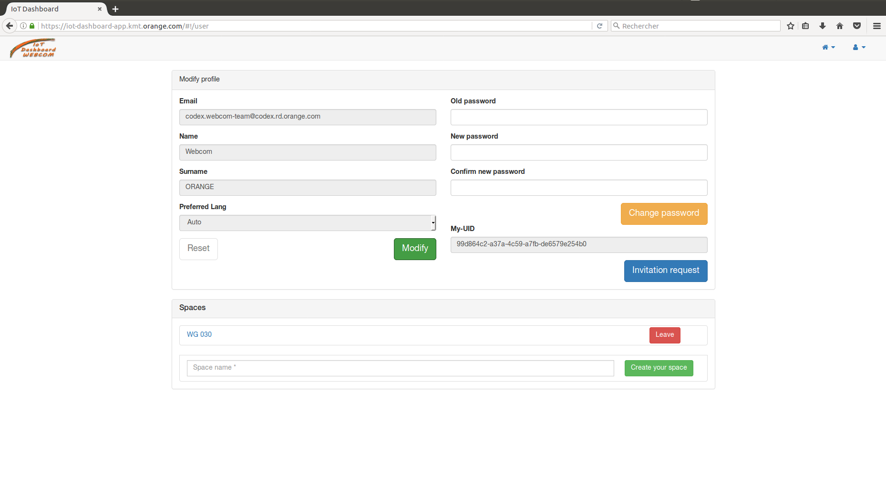

# IoT Dashboard project

This project is a first template using the Webcom tools in the field of IoT.
This project is an example of web application that uses webcom and angularjs together.

## Web application

This application is used to manage connected objects. It is based on [AngularJs](https://angularjs.org/) framework and [Webcom SDK JS](https://datasync.orange.com/doc/tutorial-stepbystep.html), and it is tested by using [KARMA](http://karma-runner.github.io/1.0/index.html) framework.

In this application you can access to several pages:

* The sign up Page


* The login Page


* The user profil Page


* The object space edition Page


* The object management Page


### Prerequisites

In order to use the application on your development environment ([Ubuntu](https://www.ubuntu.com/)), you have to install some tools.

* [NodeJs](https://nodejs.org/en/) and [NPM](https://www.npmjs.com/)

```
$ sudo apt-get update
$ sudo apt-get install nodejs npm
```

### Launching the development environment

In order to get a development environment running on your computer, you have to clone the project before:

* Defining the namespace by changing the variable "datasyncUri" in the [config-service.js](app/services/config-service.js) file
* Installing all the project dependencies mentionned in the file : [package.json](package.json)

```
$ cd iot-dashboard/
$ npm install
```

* Launching the development environment

```
[still in the iot-dashboard/ folder]
$ npm run dev
```

After launching the development environment, you have to open, in the browser of your choice, this link: [http://localhost:8080](http://localhost:8080)

### Running the tests

These tests test three things:

* Application services (AngularJs)
* Application modules (AngularJs)
* Security rules (Webcom)

In order to run the auomated tests, you have to define the admin credentials in the [tools.js](test/tools.js) file. After this, you have to define the namespace for tests, by changing the two variables "datasyncUri" and "WebcomAppName" in the [testConfig.js](test/testConfig.js) file. In the end, you have to use this command.

```
[still in the iot-dashboard/ folder]
$ npm test
```

To do parallel tests on differents browsers, you have to modify the [karma.conf.js](karma.conf.js) file by adding the name of the browser, separated by a comma, to the variable "browsers" and the corresponding plugin to the variable "plugins".

### Deployment

To deploy the application, you have to use the command below:

```
[still in the iot-dashboard/ folder]
$ npm start
```

After launching the development environment, you have to open, in the browser of your choice, this link: [http://localhost:8080](http://localhost:8080)

### Built With

* [NodeJs](https://nodejs.org/dist/latest-v6.x/docs/api/) - v6.11.3
* [Webcom SDK](https://www.npmjs.com/package/webcom) - v1.3.2
* [AngularJs](https://www.npmjs.com/package/angular) - v1.6.6
* [KARMA](https://www.npmjs.com/package/karma) - v0.13.22
* [webpack](https://www.npmjs.com/package/webpack) - v2.7.1


## Developers

* **BOUCHTAOUI Otmane** - *Trainee* - otmane.bouchtaoui@orange.com
* **BOUHLEL Aymen** - *Trainee* - aymen.bouhlel@orange.com
